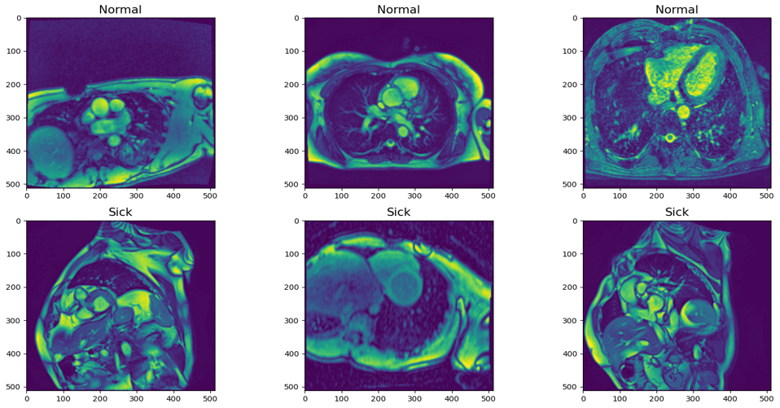
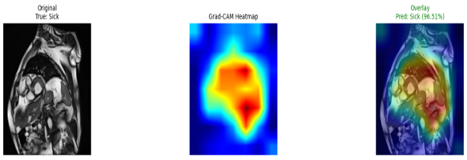
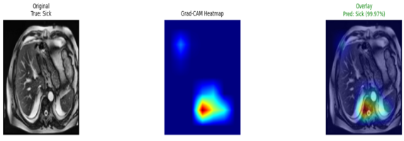
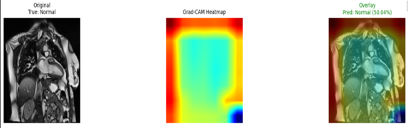
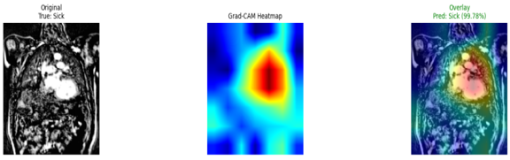
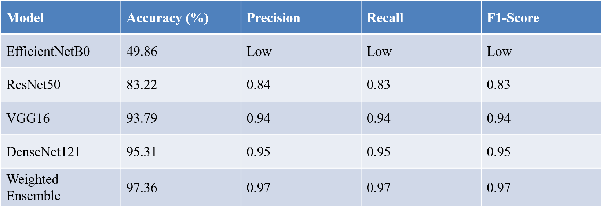

## 👨‍💻 Author

**Avinandan Roy**  
BSc in Computer Science & Engineering  
Daffodil International University

🔹 AI & Machine Learning Enthusiast  
🔹 Web Developer (Django, React, Redux)  
🔹 Researcher in Computer Vision

📧 Email: abhinandanroylipi@gmail.com  
🌐 GitHub: https://github.com/AvinandanRoy  
💼 LinkedIn: https://www.linkedin.com/in/avinandan-roy-3b2629366/

---

### 🧠 Research Interests

- Machine Learning & Deep Learning
- Computer Vision
- Medical Image Analysis
- Explainable AI (XAI)

---

# 🤖 Cardiovascular Disease Detection Using Deep Learning

### A CNN-Based Ensemble and Transfer Learning Approach

> **AI-Powered Cardiovascular MRI Classification for Early Diagnosis**

---

## 📌 Overview

This project presents the design and implementation of an automated cardiovascular disease detection system using MRI image analysis and deep learning techniques. Cardiovascular diseases (CVDs) remain one of the leading causes of death worldwide, making early and accurate diagnosis critically important.

The proposed system leverages Convolutional Neural Networks (CNN) and transfer learning models to classify MRI images into **Normal** and **Sick** categories. Additionally, Grad-CAM visualization techniques are applied to enhance model interpretability and provide visual explanations for predictions.

This research demonstrates how AI-assisted diagnostic systems can support medical professionals by improving accuracy, efficiency, and reliability in disease detection.

---

## 🎯 Project Objectives

- Develop a robust deep learning-based MRI classification model
- Apply transfer learning techniques for performance optimization
- Perform image preprocessing and data augmentation
- Evaluate model performance using multiple metrics
- Implement Grad-CAM for explainable AI visualization
- Compare multiple CNN architectures for best performance

---

## 🛠️ Technologies Used

### 👨‍💻 Programming Language

- **Python** – Core programming language for model development and experimentation

### 🤖 Deep Learning & Machine Learning

- **TensorFlow**
- **Keras**
- **Scikit-learn**

### 🖼️ Image Processing

- **OpenCV**
- **Keras ImageDataGenerator**

### 📊 Data Analysis & Visualization

- **NumPy**
- **Pandas**
- **Matplotlib**
- **Seaborn**

### 🧠 Model Architectures Used

- **ResNet50**
- **VGG16**
- **EfficientNetB0**
- **DenseNet121**
- Custom CNN Model

### 🔍 Explainability

- **Grad-CAM (Gradient-weighted Class Activation Mapping)**

### 💻 Development Environment

- Jupyter Notebook
- Kaggle Notebook
- Google Colab
- GPU Acceleration

---

## 📂 Methodology

1. Data Collection and Organization
2. Image Preprocessing (Resizing, Normalization, Augmentation)
3. Model Training using CNN & Transfer Learning
4. Performance Evaluation
5. Grad-CAM Visualization for Interpretability
6. Comparative Analysis of Architectures

---

## 📸 Dataset Visualization

### Sample Dataset

### Dataset After Preprocessing

---

## 📸 Grad-CAM Visualizations

### ResNet50

### VGG16

### EfficientNetB0

### DenseNet121

---

## 📊 Results & Analysis

The models were evaluated using:

- Accuracy
- Precision
- Recall
- F1-Score
- Confusion Matrix

### Performance Analysis

### Confusion Matrix

---

## 🏁 Conclusion

The experimental results demonstrate that deep learning and transfer learning models are highly effective for cardiovascular MRI classification. The integration of Grad-CAM enhances transparency and trustworthiness of the system by providing visual explanations of model decisions.

This project contributes to the advancement of AI-driven medical diagnostics and highlights the potential of explainable deep learning in healthcare applications.

---
